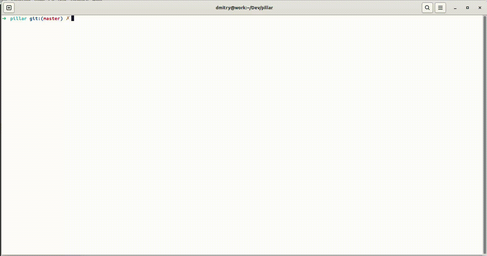

# ExUnitSummary

The library was created as an extension for EчUnit and adds test case output, just like Rspec does.

It's a very convenient life cycle for fixing and adding tests is obtained.

The developer just needs to select any entry from the results, copy it and paste it again into the console

See the example below




## How to add a library to your project

```elixir
def deps do
  [
    {:ex_unit_summary, "~> 0.1.0", only: [:dev, :test]}
  ]
end
```

## How to setup

```elixir
# test_helper.exs 

# Start ExUnitSummary application, with recommended config 
ExUnitSummary.start(:normal, %ExUnitSummary.Config{filter_results: :failed, print_delay: 100})

# Add ExUnitSummary.Formatter to list of ExUnit's formatters. 
ExUnit.configure(formatters: [ExUnit.CLIFormatter, ExUnitSummary.Formatter])
```

# Contribution

Feel free to make a pull request. All contributions are appreciated!
